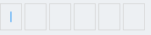

# 一款可高度复用的 react-hook 验证码输入组件

### 组件有什么效果？



1. 可自定义验证码长度，默认为6

2. 未输入会显示输入光标

3. 可及时获得输入更新，需要传递 getCode 函数

---

### <font color=#EE000>本组件未使用 webpack 进行打包处理</font> ， 如果想直接使用，请参见以下命令

```
npm i @auspicious/react-vercode
```

---

### 使用请注意

1. 你需要使用 React-Hook 和 TypeScipt

2. 你的项目需要使用 less-loader 进行 CSS 编译 (或者你也可以自己抽离出来)